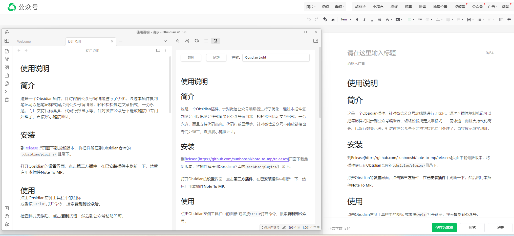

# WDWXEdit

一款强大的 Obsidian 插件，能够将笔记无缝发布到微信公众号，完美保持格式。



## 🌟 功能特性

- **完美格式保持**: 发布到微信公众号时保持笔记原始样式
- **代码高亮**: 支持完整语法高亮，可自定义主题
- **数学公式支持**: 完美渲染 LaTeX 和 AsciiMath 公式
- **本地图片上传**: 自动上传本地图片到微信媒体库
- **多主题支持**: 30+ 内置主题，打造精美文章展示
- **自定义样式**: 支持自定义字体、字号、主题色和CSS
- **标注块支持**: 完整支持 Obsidian 标注块，美观样式
- **草稿管理**: 直接在微信公众号后台创建草稿

## 📸 功能展示

### 样式编辑器

*支持主题、代码高亮、字体、字号、主题色自定义*

### 发布效果对比

*左侧为 Obsidian 笔记，右侧为微信公众号预览效果*

### 代码高亮效果

*支持 60+ 种编程语言语法高亮*

## 🚀 快速开始

### 安装

#### 从社区插件安装（推荐）
1. 打开 Obsidian 设置
2. 进入社区插件并关闭安全模式
3. 点击浏览，搜索 "WDWXEdit"
4. 安装并启用插件

#### 手动安装
1. 从 [Releases](https://github.com/IsHexx/WDWXEdit/releases) 下载最新版本
2. 解压到 `.obsidian/plugins/wdwx-edit/` 目录
3. 重启 Obsidian
4. 在设置中启用插件

### 配置

1. **获取微信公众号凭证**:
   - 登录微信公众号后台
   - 进入设置 → 基本设置 → 开发者ID
   - 获取 AppID 和 AppSecret

2. **配置插件**:
   - 打开 Obsidian 设置 → WDWXEdit
   - 输入公众号信息（格式：`名称|AppID|AppSecret`）
   - 点击"保存公众号信息"

3. **开始发布**:
   - 打开任意笔记
   - 点击左侧边栏的"微信"图标
   - 选择复制内容或创建草稿

## 📖 使用方法

### 发布选项

- **复制到剪贴板**: 复制格式化 HTML，粘贴到微信编辑器
- **创建草稿**: 直接在微信公众号后台创建草稿
- **预览效果**: 实时预览发布后的样式

### 样式自定义

**主题选择**: 从 30+ 专业主题中选择
- 默认主题
- Markdown 经典主题
- 代码技术主题
- 清新简约主题

**样式编辑器**:
- 🎨 **主题色**: 6种预设颜色 + 自定义颜色选择器
- 🔤 **字体**: 等线、无衬线、衬线、等宽
- 📏 **字号**: 14px - 24px 多种选择
- 💻 **代码高亮**: 60+ 种高亮主题
- ✨ **自定义CSS**: 支持添加自定义样式

### 支持的内容

- ✅ **标题**: 所有标题级别，可自定义样式
- ✅ **代码块**: 语法高亮，支持行号
- ✅ **数学公式**: LaTeX 和 AsciiMath 支持
- ✅ **图片**: 本地图片自动上传到微信媒体库
- ✅ **链接**: 转换为微信兼容格式
- ✅ **标注块**: Obsidian 标注块，美观样式
- ✅ **表格**: 完整表格支持，带样式
- ✅ **列表**: 有序和无序列表
- ✅ **引用**: 样式化引用块

## ⚙️ 配置选项

### 基础设置

- **AppID/AppSecret**: 微信公众号开发者凭证
- **主题选择**: 选择偏好主题
- **代码高亮**: 选择代码高亮主题
- **图片质量**: 设置图片压缩质量（0.1-1.0）
- **图片最大宽度**: 设置图片最大宽度（像素）

### 样式自定义

- **字体**: 选择文章字体类型
- **字号**: 选择文章字号大小
- **主题色**: 选择或自定义标题颜色
- **自定义 CSS**: 添加自定义样式规则

### 高级功能

- **自定义 Frontmatter**: 控制单笔记设置
- **样式覆盖**: 按笔记覆盖主题样式
- **图片水印**: 为上传图片添加水印（即将支持）

## 📝 Frontmatter 支持

在笔记的 frontmatter 中添加这些选项来覆盖默认设置：

```yaml
---
theme: github-light
customCSS: |
  .content { font-size: 16px; }
watermark: true
---
```

## 🎯 版本历史

### v1.3.1 (最新)
- ✨ 新增自定义主题色选择器
- 🔤 新增字号选项：20px、22px、24px
- 🐛 修复重置样式功能不完整问题
- 🎨 优化样式编辑器UI和交互

### v1.3.0
- ✨ 全新架构重构
- 🎨 现代化UI设计
- ⚡ 性能优化

[查看完整更新日志](https://github.com/IsHexx/WDWXEdit/releases)

## ❓ 常见问题

### Q: 图片上传失败怎么办？
A: 确保：
1. AppID 和 AppSecret 配置正确
2. 微信公众号有权限上传图片
3. 图片大小不超过 2MB
4. 图片格式为 jpg/png

### Q: 如何设置多个公众号？
A: 在设置中每行一个公众号信息，格式：`名称|AppID|AppSecret`

### Q: 支持哪些 Obsidian 版本？
A: 最低支持 Obsidian v1.4.5

### Q: 为什么代码高亮没有效果？
A: 检查是否选择了代码高亮主题，推荐使用 `github` 或 `atom-one-dark`

## 📄 许可证

本项目采用 MIT 许可证 - 详见 [LICENSE](LICENSE) 文件。

## 📞 支持与反馈

- **问题反馈**: [GitHub Issues](https://github.com/IsHexx/WDWXEdit/issues)
- **功能建议**: [GitHub Discussions](https://github.com/IsHexx/WDWXEdit/discussions)
- **联系作者**: [IsHexx](https://github.com/IsHexx)

## 🙏 致谢

感谢所有为这个项目做出贡献的开发者和用户！

---

⭐ 如果这个插件对你有帮助，请给个 Star 支持一下！

用 ❤️ 为 Obsidian 社区打造
